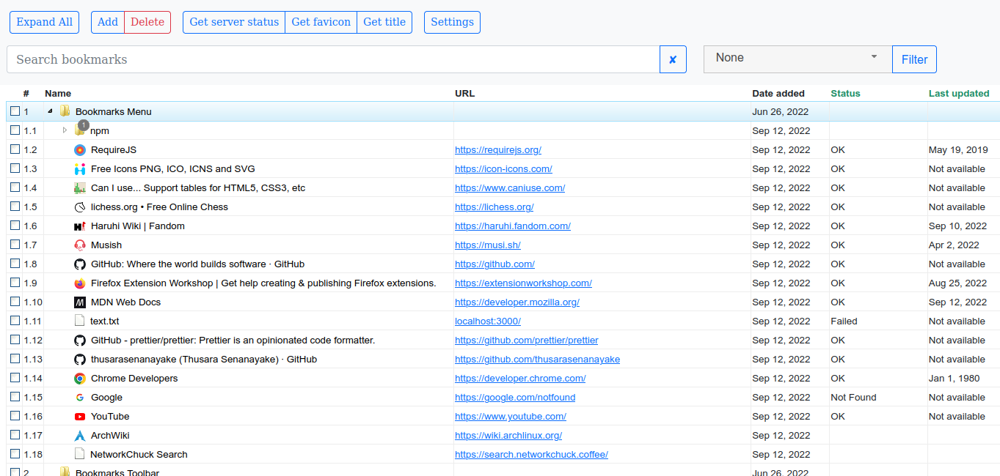
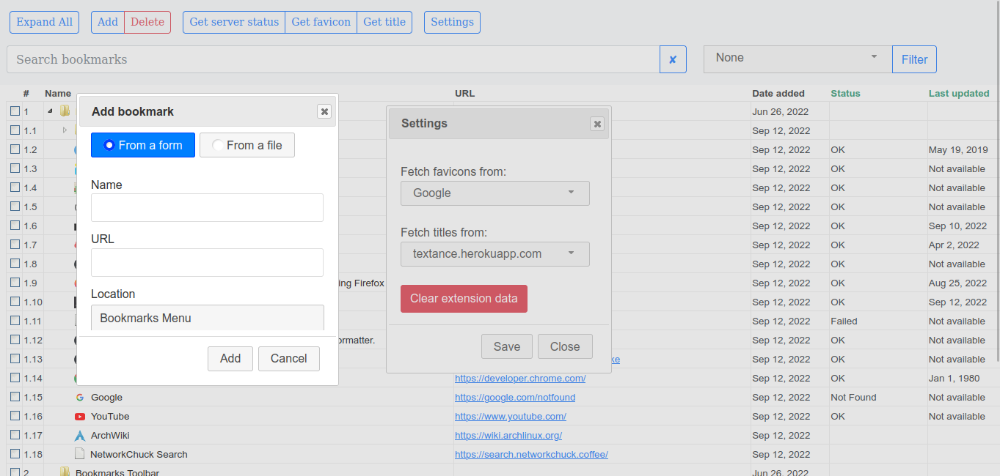
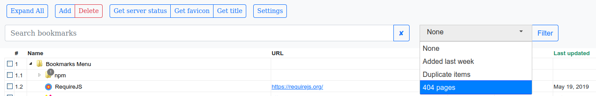

  <p align="center">
    
  </p>

  <h3 align="center">Handy Bookmarks Manager</h3>

  <p align="center">
   Extension for Firefox to manage bookmarks
    <br />
    <br />
    <a href="https://github.com/Handy-Bookmarks-Manager/hbm-ff/issues">Report Bug</a>
    ·
    <a href="https://github.com/Handy-Bookmarks-Manager/hbm-ff/issues">Request Feature</a>
  </p>

<hr />

<p>
  
  <a href="https://github.com/Handy-Bookmarks-Manager/hbm-ff/graphs/commit-activity" target="_blank">
    
  </a>
  <a href="https://github.com/Handy-Bookmarks-Manager/hbm-ff/blob/master/LICENSE.txt" target="_blank">
    
  </a>
</p>

### About The Project

<b> Features </b>

<ul>
  <li>Add bookmarks from a text file</li>
  <li>Update/repair titles of your bookmarks</li>
  <li>Filter 404 (not found) pages</li>
  <li>Filter Duplicate bookmarks</li>
  <li>List server status</li>
</ul>

<br />





#### Built With

-   jQuery
-   jQuery UI
-   Fancy Tree
-   Bootstrap CSS

#### Available Shortcuts

-   'f2' | 'shift+click' | 'mac+enter' - to edit

### Install

 <a href="https://addons.mozilla.org/en-US/firefox/addon/handy-bookmarks-manager" target="_blank">
     
  </a>

### Contributing

Contributions, issues and feature requests are welcome!<br />Feel free to check [issues page](https://github.com/Handy-Bookmarks-Manager/hbm-ff/issues). You can also take a look at the [contributing guide](https://github.com/Handy-Bookmarks-Manager/hbm-ff/blob/master/CONTRIBUTING.md).

### Todos

-   settings to change font size
-   add keyboard shortcuts
-   cut and paste
-   drag and drop
-   feature - change themes (tree.js#2)
-   add a pop-up page

### Known Issues

-   ~~multiple favicon renders on search~~
-   checkboxes not showing after 'Expand All'

### For Developers

> Developed on : Ubuntu 22.04 LTS

1. Clone the repo
    ```sh
    git clone https://github.com/Handy-Bookmarks-Manager/hbm-ff.git
    ```
2. Install NPM packages
    ```sh
    npm install
    ```
3. Run Development environment
    ```sh
     npm run dev
    ```
4. Build
    ```sh
     npm run build
    ```

### Author

👤 **Thusara Senanayake <gh@thusara.slmail.me> (https://thusarasenanayake.github.io)**

-   Github: [@Handy-Bookmarks-Manager](https://github.com/Handy-Bookmarks-Manager)

### License

This project is licensed under the terms of the [GPLv3](https://github.com/Handy-Bookmarks-Manager/hbm-ff/blob/master/LICENSE.txt).
